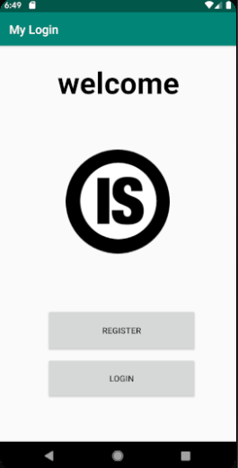
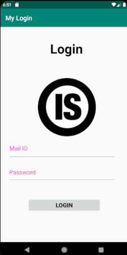

#  My.Login.Firebase-2020
Simple Login page and Registration Page using Firebase in Android Studio(Basic project).

### We have following activities in our application
 ****

  - Registration Activity
  - Login Activity
  - Main Activity
  - Dashboard
  
### Registration
**** 
Here the user register for the application using mail id which is authenticated using firebase.

### Login
**** 
Here the Registered user is allowed to login to their account
authenticated using firebase.

### Main Layout
****
Here there is a Button that allow the user to go to login or registration page.

### Dashboard
****
Here the user can add what ever activity after login.

### Execution
 ****
- The Login and Registration process is by connecting to firebase.

### Application user interface
 ****
<table>
  <tr>
    <td>Main Activity</td>
     <td>Registration Page</td>
     <td>Login Page</td>
	  <td>Dashboard</td>
  </tr>
  <tr>
    <td></td>
    <td></td>
    <td></td>
	 <td></td>
  </tr>
 </table>

Thank you...
